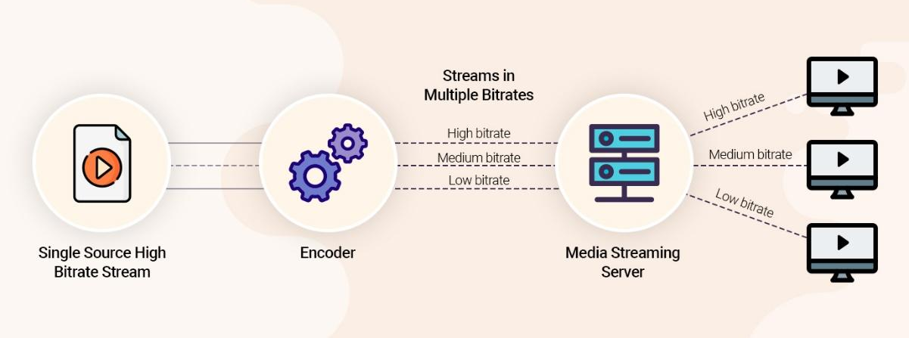
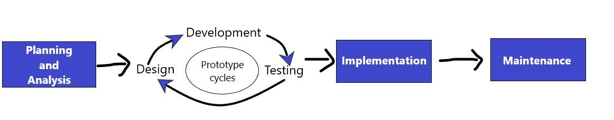

# CHAPTER ONE

## 1. GENERAL INTRODUCTION

### 1.1 BACKGROUND OF STUDY

Recent years have seen a quick adoption of live online lecturing in the
educational sector. In this era, online lecturing has become the norm
due to the global COVID-19 pandemic.

A live online lecturing is a real-time session that enables lecturers or
teachers and students to replicate many elements of an in-person class
while online. The instructors teach, and the participants learn in
real-time, face-to-face but via internet-enabled technology devices.

Online lecturing makes it possible for teachers to teach students at
diverse geographical locations. Also, we can automate some major
processes of face-to-face lecturing. For instance, we can record student
attendance automatically for the instructor.

Building a live online lecturing platform involves a lot. A common
misconception is that live tutoring is just about video streaming.
Although video streaming is the most important part of every live online
lecturing platform, a live online lecturing platform comprises other
features like online whiteboards, chat windows, data logging, class
scheduling system, notification system, and user authentication and
authorization system.

Video streaming is the continuous transmission of audio or video data or
files from a server to a client. With streaming, we broadcast the media
or store it online, and transmit seconds of it over the Internet to play
on the client device such as a mobile phone or laptop. Video streaming
allows the user to download video content while watching it
simultaneously. We view the content online, rather than saving it to a
device.

Video streaming comprises video-on-demand streaming (VOD) and live
streaming.

**Live streaming** is streaming real-time or live video feed to an
audience retrieving the media stream over the internet. It requires a
camera and/or microphone for capturing the media content, which the
encoder encodes into multiple bitrate streams. The server relays the
multiple bitrate streams to a media server or CDN (content delivery
network) to distribute or deliver content to the audience. For example,
YouTube, Facebook Live, Periscope, and Twitch are live streaming
services.

**VOD** enables the audience to watch or listen to media stream content
on request. For example, Netflix and YouTube are on-demand streaming
services.

Streaming media over the internet for an audience to watch requires
adopting a streaming technique such as Adaptive Bitrate streaming or
Multi-Bitrate streaming, on the media server.

**Adaptive bitrate streaming (ABR)** is a technique for progressively
adjusting the compression level and video quality of a stream to match
the user's bandwidth availability, user's network conditions, and device
performance. Netflix implements adaptive streaming on its media servers.

{class="center_align"}

***Figure 1.1: Encoding and Decoding of stream***

In **Multi-Bitrate (MBR) streaming**, we make a particular video stream
available in multiple bitrates, and the user has to select the best
possible video quality from the variety of options available. YouTube
implements multi-bitrate streaming on its media servers.

As presented in Figure 1.1, we observed that the system transfers a
single video source stream to the encoder, which encodes the single
video source into multiple bitrates. We then transfer the multiple
bitrates to the media server (A media server is a network device that
saves and shares media) which handles transferring stream bitrates to
viewers\' devices using adaptive bitrate streaming or multi-bitrate
streaming.

For a live video streaming service, adding a text messaging feature is
important. Creating a text messaging feature requires the use of
messaging protocols. Examples: WebSocket. The WebSocket messaging
protocol makes it easy to create text messaging for a live online
lecturing platform.

In the WebSocket protocol, a client sends an **HTTP** request which adds
the **UPGRADE** header to the request. The server takes the request and
recognizes the client wants to upgrade the regular one-to-one **HTTP**
connection to a **WebSocket** connection. The server will reply either
by switching protocols with a **101** HTTP status code or not. This
creates a bidirectional connection that can be closed if the connection
ends.

An online whiteboard feature is a replica of the traditional classroom
whiteboard. This feature is more advanced and interactive because you
can open multiple whiteboards to draw, illustrate, show diagrams, upload
presentations, images or even play videos from your library.

### 1.2 PROBLEM STATEMENT

Live online lecturing has become an important technology used in the
educational sector lately because of the outbreak of the COVID-19
pandemic. Institutions are utilising live online lecturing platforms to
conduct classes.

Adapting to this way of teaching and learning has been difficult for the
University of Professional Studies Accra (UPSA), because of the
following issues:

- Unstable internet access at some places in the country where
    teachers and students live.

- Teachers and students required to download, install and update
    streaming software like Zoom

- Teachers and students not having computers that meet the system
    requirements of software

- High consumption of data bandwidth by the streaming software

- Teachers and students finding it difficult to understand the
    interface of streaming software like Zoom

- The streaming software does not record student's attendance hence
    students do not attend the class

The issues listed above made it difficult for teachers and students to
conduct online lectures.

Based on the issues listed above, the research team intends to develop a
live online lecturing platform for the University of Professional
Studies Accra (UPSA), for conducting classes online.

The benefits of the proposed system for teachers and students are:

- Improving video performance and quality

- Access from any internet browser

- Lower consumption of data bandwidth

- Not requiring download, installation, and update of software

- Easy to schedule, manage and monitor live online classes

- Easy, user-friendly, and accessible user interface

- Not requiring users to have computers with higher specifications

- The system records class attendance

- Increase engagement with real-time audio-video and textual
    communication

### 1.3 SCOPE OF THE PROJECT

The beneficiaries of this project are only the University of
Professional Studies Accra (UPSA) students and lecturers. The research
team estimates the system to host up to 300 participants for each
meeting including the instructor.

The development of the project will last for a maximum of 4 months.

The live online lecturing platform does not implement the whiteboard and
video recording features.

Although every video streaming technology used on a live online
lecturing platform requires an encoder and a media server, the study
will not involve creating the encoder and media server, but the research
team will integrate a production-ready media server called Ant Media
server.

### 1.4 LIMITATION OF THE STUDY

In developing the platform, the research team will face hitches that
will limit the study. The difficulties the study will face are:

- The project is only limited to the studied population (UPSA).

- Having limited time to research and develop the project.

- Deployment and uptime running cost of the software

- Requires internet connectivity

- Support for older browsers not implemented

- Learning new technologies like Python, HTML, CSS, JavaScript, and
    Bootstrap 5 CSS framework.

### 1.5 OBJECTIVES OF THE STUDY

#### 1.5.1 General Objective

The primary aim of the study is to develop a live online lecturing
platform for teaching and learning at UPSA. To achieve this aim, the
team must build the frontend and backend of the system.

#### 1.5.2 Specific Objectives

To achieve the general aim, the team planned the following specific
objectives to guide the project.

1. Build frontend of the system
      1. develop the interface for the home page about page, attendance page, contact page, and page not found
      2. develop the interface for the host class page and the join class page
      3. develop the interface for the studio page and viewer page
2. Build backend of the system
      1. manage online class sessions
      2. authenticate instructors
      3. integrate the database (MongoDB) and the media server (Ant Media server)
      4. stream online class sessions
      5. connecting or disconnecting instructors and participants to/from their classrooms
      6. create a simple text messaging platform for group interactions
      7. track class attendance automatically
      8. send emails and generate attendance reports

### 1.6 METHODOLOGY

To develop the proposed study, the team used the Rapid Application
Development software development method. This method involves software
users in all stages of application development.

{class="center_align"}

***Figure 1.2: Steps of Rapid Application Development***

**Rapid Application Development (RAD)** is a form of agile software
development method which prioritizes quick prototype releases and
iterations. Unlike the Waterfall method, RAD uses software and user
feedback instead of rigorous planning and requirements capturing.

All iteration involves teams working simultaneously on various areas
like:

- Planning and Analysis

- Design

- Development

- Testing

- Implementation

- Maintenance

At the end of the iteration, the team displays a working product to the
customer and important stakeholders.

### 1.7 ORGANIZATION OF STUDY

Chapter one deals with the general introduction which includes the
background of the study, problem statement, the scope of the project,
limitation of the study, objectives of the study, and methodology.
