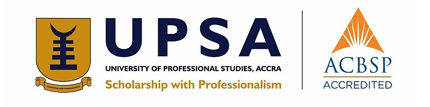

---
hide:
  - navigation
  - toc
---

# Welcome to Web-Streamer Docs

{class="center_align"}

**FACULTY OF INFORMATION TECHNOLOGY AND COMMUNICATION STUDIES
DEPARTMENT OF INFORMATION TECHNOLOGY STUDIES
UNDERGRADUATE WORK**

**AN ONLINE VIDEO LECTURING PLATFORM FOR LEARNING AND TEACHING AT THE
UNIVERSITY OF PROFESSIONAL STUDIES ACCRA (UPSA)**

BY

**ACKOM KAREN**  

**DUODU RANDY**  

**JULY 2021**

THIS PROJECT REPORT IS SUBMITTED TO THE DEPARTMENT OF INFORMATION
TECHNOLOGY STUDIES OF THE FACULTY OF INFORMATION TECHNOLOGY AND COMMUNICATION STUDIES OF THE UNIVERSITY OF
PROFESSIONAL STUDIES, ACCRA IN PARTIAL FULFILLMENT FOR A BACHELOR OF
SCIENCE DEGREE IN INFORMATION TECHNOLOGY MANAGEMENT

## CANDIDATES' DECLARATION

We, the undersigned do hereby declare that this dissertation is the
result of our original research and that no part of it has been
presented for another Degree in any University. We are convinced that
this project was not copied from any other person. All sources of
information have however been acknowledged with due respect.

ACKOM KAREN 10090428 31st JULY, 2021  
DUODU RANDY 10087872 31st JULY, 2021

## SUPERVISOR'S DECLARATION

I declare that the preparation and the presentation of this Dissertation
were under the guidelines on supervision of the Dissertation laid down
by the University of Professional Studies, Accra (UPSA).

DR. BEN OCRA  
Date: 31st JULY, 2021

## DEDICATION

The team dedicates this dissertation to God Almighty who has been of
tremendous help in making this study a success. Also, to our beloved
parents and benefactors for sponsoring our education and also to all
UPSA teaching and non-teaching staff for their explicit support, we
dedicate this work to you all.

## ACKNOWLEDGEMENTS

We extend our first gratitude to Almighty God for protecting and guiding
us through the University of Professional Studies, Accra (UPSA).

To our unrelenting supervisor, Dr Ben Ocra under whose guidance and
supervision this research has become a success, we remain extremely
grateful. We further extend gratitude to all lecturers and students
whose diverse contributions have led to the successful completion of
this study.

Finally, we appreciate all the contributions made by our families and
friends and the staff of the Department of Information Technology
Studies of the Faculty of Information Technology and Communication
Studies of the University of Professional Studies, Accra (UPSA) and the
entire university for their help during the testing and implementation
of this system.

## ABSTRACT

Education is vital to the growth of an economy and conducting teaching
and learning online is also important although the world is battling
with a pandemic (i.e., COVID-19). Adapting to alternative ways of
acquiring knowledge will not only help to prevent a pandemic but will
improve our education system. The University of Professional Studies
faces the challenge of conducting effective online video lecturing.

To solve this problem, the research reviewed existing information
related to how UPSA conducts online video lecturing, which saw Zoom as
the solution used by UPSA. The challenges of the existing system (Zoom)
such as the high system requirements, downloading and installing, and
other reasons motivated the team to build the current system. The team
seeks to allow teachers to record student attendance, and lecture
students with no unnecessary interferences. The team uses the Rapid
Application Development software development method because it does not
prolong the software development time. The team tested the current
system to ensure it meets users and functional requirements, and also to
ensure it is production-ready. The current system is a web application
that requires the user to have a modern web browser like Chrome or
Firefox installed on their devices. The major limitation of the current
system is the lack of support for older browsers like Internet Explorer
8. The research team recommends the following features for future works:
Future works should add features like importing scheduled events to the
calendar, whiteboards, waiting room, recording, and conference room
meeting. Future works should integrate a well-developed help-desk
support system to improve user support.
